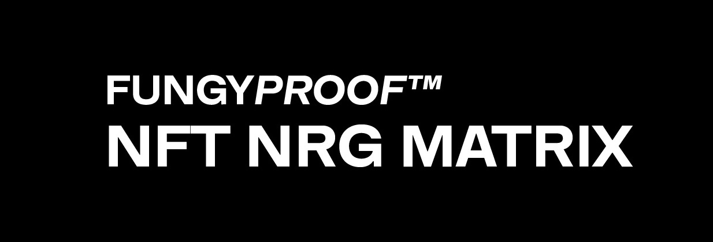

Research regarding the energy consumption of available permutations for blockchains, contracts, and asset storage solutions in relation to NFTs. Resulting research is compiled and organized into a comparison matrix to visualize findings in a digestible format. 

---

[WIP]
