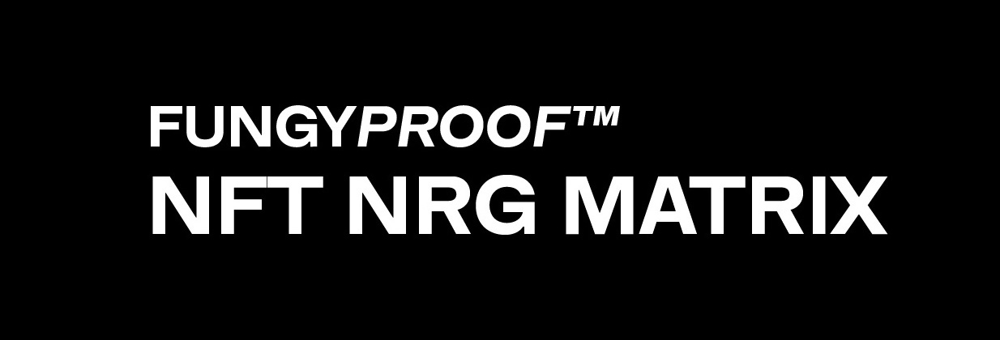
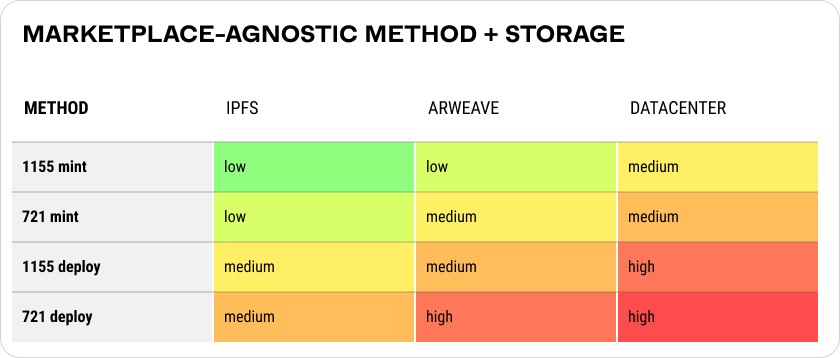
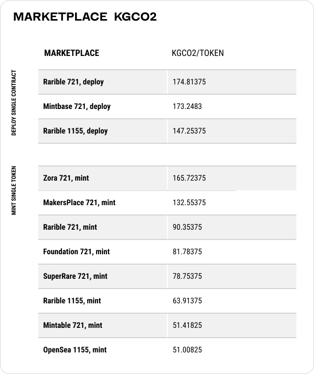
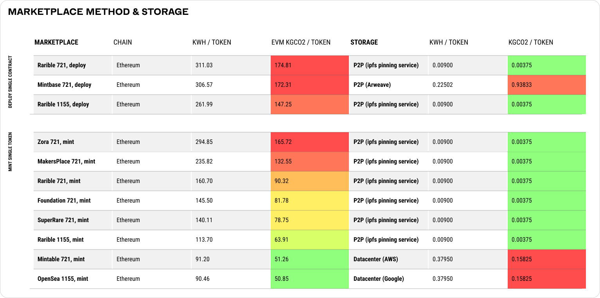
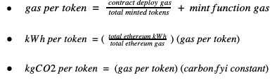
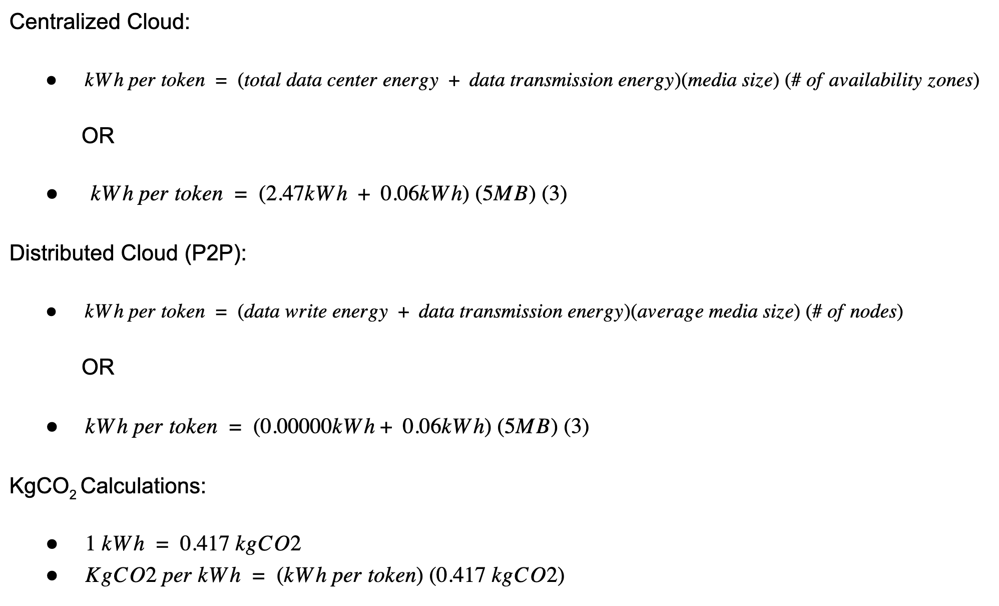

This work was originally done for the Gitcoin [Green NFT Hackathon: Awareness Prize Bounty](https://gitcoin.co/issue/GreenNFT/GreenNFTs/2/100025261) with future plans to integrate it into the [FungyProof](https://fungyproof.com) grading system.

**Results**
* [Background Research](#background-research)
* [Energy Matrix PDF](fungyproof-nrg-matrix.pdf)

Submitted: 05/06/2021

Authors: Mike Roth, Brandon Roth

---

# Background Research

_// This is a working draft and is not peer reviewed, we welcome contributions, corrections, and revisions. Please create a PR to contribute //_

<!-- START doctoc generated TOC please keep comment here to allow auto update -->
<!-- DON'T EDIT THIS SECTION, INSTEAD RE-RUN doctoc TO UPDATE -->
# Table of Contents

- [Introduction](#introduction)
- [Summary and Results](#summary-and-results)
  - [Tables](#tables)
    - [Table 1 - Marketplace-agnostic Perceived Energy Consumption](#table-1---marketplace-agnostic-perceived-energy-consumption)
    - [Table 2 - Marketplace kgCO2](#table-2---marketplace-kgco2)
    - [Table 3 - Comparison of Marketplace Energy Consumption and Emissions](#table-3---comparison-of-marketplace-energy-consumption-and-emissions)
- [Methodology](#methodology)
  - [Smart Contract Selection Criteria](#smart-contract-selection-criteria)
    - [Marketplace Analysis](#marketplace-analysis)
  - [EVM NFT Creation](#evm-nft-creation)
    - [Overview](#overview)
    - [Layer2 and Other Blockchains](#layer2-and-other-blockchains)
    - [Assumptions and Limitations](#assumptions-and-limitations)
  - [Storage](#storage)
    - [Overview](#overview-1)
    - [Transfer Consumption](#transfer-consumption)
    - [Storage Consumption](#storage-consumption)
    - [Assumptions and Limitations](#assumptions-and-limitations-1)
- [Bibliography](#bibliography)

<!-- END doctoc generated TOC please keep comment here to allow auto update -->

# Introduction

Non-Fungible Tokens (NFTs) on the current Proof of Work (POW) Ethereum network have garnered a lot of attention for their high energy consumption, however, the relationship between an NFT and the energy required to create it is a layered web of smart contracts, storage solutions, and marketplaces. 

New technological developments including but not limited to smart contract efficiency improvements, layer 2 solutions, and alternative blockchains are improving NFT carbon footprints, however, despite these efforts millions of NFTs have already been produced and many more will continue to be produced using the original POW methods.

The intended goal of this research is two-fold. 1) present NFT participants with a reference guide for understanding energy consumption of existing technologies. 2) provide a reference guide for offsetting the carbon footprint of tokens and their media assets. Visit [learn.fungyproof.com](https://learn.fungyproof.com/) for a primer on the underlying NFT architecture explored here.

# Summary and Results

The research attempts to define a model for extracting the energy costs, relayed in kWh and kgCO2, of deploying a single smart contract, minting a single token, and uploading related media assets to storage. Estimations are described across current technologies that fit the criteria. 

The data is presented in a simplified matrix that describes marketplace and/or smart contract type mapped to storage type. Each overlap is given a color value to indicate perceived total energy consumption / CO2 output. 

Based on the findings, deploying a single ERC1155 contract (or using someone else’s), minting tokens from that contract (preferably with lazy minting), and pinning assets in consumer hardware InterPlanetary File System (IPFS) nodes is the most energy efficient Layer 1 Ethereum Virtual Machine (L1 EVM) solution. When it comes to storage the impacts are minimal, however, the energy use is based on the number of times the media is viewed (network transfer). Popular NFTs with a large media filesize can lead to significant energy consumption / CO2 emissions.

**[View Results PDF](fungyproof-nrg-matrix.pdf)**

## Tables

The complexity of the ecosystems examined contain a large number of ever-changing variables. The methodology section attempts to clarify choices made in defining the data. Additional sections outlining primary assumptions and proposed work are surfaced for easier reference.

You can view the original/underlying calculations of the following resulting tables here:

**[Results Spreadsheet](https://docs.google.com/spreadsheets/d/1h2QZ0Zzedj-y-Vj53MCyjuEs8bNtuvah-Rr6hoAp7Is/edit#gid=1215643291)**

### Table 1 - Marketplace-agnostic Perceived Energy Consumption 

The following table displays the total perceived energy consumption for marketplace-agnostic minting and deploying in conjunction with various asset storage options.

### Table 2 - Marketplace kgCO2

The following table displays the total emmisions in kgCO2 of the creation of a single NFT across various marketplaces.

###  Table 3 - Comparison of Marketplace Energy Consumption and Emissions

The following table displays kWh and kgCO2 usage for deploying, minting, and storing assets across various NFT marketplaces.

#  Methodology

Energy consumption is analyzed across two components of an NFT: EVM creation and asset storage. 

In order to have a standard comparison between the various smart contracts, marketplaces, and storage options a specific set of criteria was used for selection as outlined below. Ethereum 1.0 Proof of Work consensus algorithm is the primary focus, however, preliminary assumptions have been factored in for L2/sidechain solutions e.g. Matic and Immutable X  as well as other L1 Proof of Stake blockchains e.g. Tezos. 

Studying asset storage began by identifying the types of storage used by each marketplace then searching for overlaps in system boundaries and unit metrics. Reference research is highly varied within this subject taking place across a decade or more.

## Smart Contract Selection Criteria

After analyzing the top 15 NFT marketplaces on Dapp Radar, 11 smart contracts currently in use by the marketplaces were identified and selected for analysis. These contracts were chosen for the following reasons: 

*   The smart contract implements the ERC-721 or ERC-1155 standard.
*   The smart contract is publicly accessible either through an ABI uploaded to Etherscan or publicly available documentation.
*   The smart contract is used in a marketplace which allows the end-user to create a custom media-based NFT.
*   The final set of smart contracts provides a non-homogeneous range of NFT creation methods and metadata storage options (covered below).

### Marketplace Analysis

The selection criteria for smart contracts and marketplaces led to the following marketplaces being analyzed.

**Zora**

Zora uses a custom contract which implements several of its own contract properties and functions. These additional contract functions and properties introduce additional gas to the deployment and minting of the contracts resulting in higher energy use.

**Mintbase**

Mintbase allows for deployment of an unmodified 721 contract and stores all assets on Arweave. Deploying a base 721 smart contract results in significant energy use.

**Rarible**

Rarible provides four different options for token creation. ERC721 minting or deployment and ERC1155 minting or deployment. This provides users with the flexibility of paying more gas (higher energy usage) to deploy their own contract or less (lower energy usage) to mint a token on the existing RARI contracts. 

**OpenSea/Mintable**

Both OpenSea and Mintable use a deferred minting method (lazy minting) to allow users to create tokens without paying for the gas until the NFT has been sold. Lazy minting may result in less energy usage but is a factor of the total token sales. In addition OpenSea allows for minting tokens on Matic L2.

**Foundation, MakersPlace, & SuperRare**

The three marketplaces are invite-only and allow mint-only operations. In general, minting a token via an existing contract is more energy efficient.

**Notable Mention: Cargo**

Cargo uses a deferred minting method (lazy minting) similar to OpenSea/Mintable. Additionally, Cargo has the ability to purchase NFTs via fiat based payment (Stripe) which could introduce additional energy consumption on top of the existing blockchain mechanics. Cargo created EIP 2309 which augments the original EIP 721 to allow for batched transfer events. Batching transfer events (among others) can improve gas efficiency for batched minting. Out of the 15 marketplaces analysed, Cargo supports minting/deploying Matic (Polygon) contracts.

## EVM NFT Creation

### Overview

Our approach to calculating the energy required to create an EVM non-fungible token is based on the carbon.fyi methodology (Offsetra) which uses Ethereum gas as the unit of measure. When it comes to creating an NFT there are two different methods. The first is to deploy a smart contract and call a mint function. The second is to call a mint function of an existing smart contract. To obtain gas use numbers we employed a combination of direct RPC calls to Ethereum and statistics available on Etherscan. 

To ensure the energy use calculation was agnostic across both methods of creation-minting and deploying a contract-the gas requirements of the contract deployment and the gas requirements of the minting function were both factored into a final “per-token” gas use metric. This means that when considering marketplaces which do not allow end-user deployment of a new contract for the creation of an NFT, the gas cost contains an economies of scale component by slightly reducing the per token footprint over time as the initial deployment gas cost is averaged out across all tokens minted. 

**Calculations:**

### Layer2 and Other Blockchains

This analysis primarily focused on the top 15 NFT marketplaces, however, new solutions are in development and alternative blockchains exist which may drastically reduce the energy required to create an NFT. These options currently have limited on-demand minting access for creators.

**Matic: Ethereum L2 Proof of Stake (OpenSea, Cargo)**

Both OpenSea and Cargo support minting tokens on the Polygon (formerly Matic) L2 proof of stake network. Matic network is a proof of stake sidechain with theoretical capabilities of 2^16 transactions per block which may drastically reduce energy consumption of NFTs created on Matic (Polygon).

**Layer2: Gods Unchained (ImmutableX / Starkware)**

Immutable X employs StarkEx ZK-rollups and has stated that the Immutable-X marketplace is capable of minting 8 million NFTs for only 1,030kWh of energy or 475,000 times less than the Ethereum equivalent (Immutable).

**Tezos: Proof of Stake (or similar)**

According to a Medium article produced by TQ Tezos, Tezos is 99% more efficient than equivalent Proof of Work blockchains (TQ Tezos).

### Assumptions and Limitations

*   Final numbers do not include efficiency gains from batch-minting.

*   When minting a mainnet NFT was cost-prohibitive, equivalent Rinkeby testnet minting or deployment was performed (this will be highlighted in the final results).
    *   **Proposed work**- deploy contracts and tokens across marketplaces
        *   Request data from gated marketplaces (ie. apply to mint)

*   The deployment of the smart contract and the minting function are the only factors taken into account when calculating the “creation of an NFT” – no additional smart contract transactions are factored into the analysis such as transfers.
*   For user-deployed NFT smart contracts a base-assumption is made that these contracts will contain ten minted tokens on average.

## Storage

### Overview

Storage options are added to highlight their place in the NFT ecosystem. When a creator uploads media associated with a token, it is generally hosted in a cloud server. [See [learn.fungyproof.com](https://learn.fungyproof.com/).]  While not directly involved with the deployment and minting of contracts and tokens, storage represents a critical aspect of the NFT ecosystem with its own challenges relating to energy, permanence, centralization, and ownership. 

**Calculations**

### Transfer Consumption 

According to _Electricity Intensity of Internet Data Transmission: Untangling the Estimates_ (Aslan et al. 2017, 786) transfer consumption is the energy used to move data through the Internet Protocol (IP) core network and access networks, excluding data-centers, home-devices, and undersea cables. The research paper, looking at 14 studies, provides an electrical intensity of data transmission estimate of 0.06 kWh/GB when taking recent information and retroactively modeling data for 2015 using the BT network in the UK.

### Storage Consumption

Storage consumption relates to the total energy consumed by on-premise cloud servers and their required infrastructure. For our example we break this into two broadly generalized categories: Centralized Cloud (Data-Centers) and Distributed Cloud (p2p). Average file size used is 5MB.

**Centralized Cloud (Data-Centers)**

Calculations for centralized cloud data center figures use an estimated electrical intensity of 2.47kWh/GB (EnerNOC Utility Solutions 2012). This research creates a boundary of "Data Center/POP" which averages power consumption across 3 tiers of data centers plus Internet Service Providers (ISP).  It is unclear whether this boundary falls outside of the Internet transmission boundary defined above but for the sake of this calculation, 2.47kWh/GB is added to the transfer energy figure of 0.06kWh/GB in an attempt to use a more current estimation.

**Distributed Cloud (p2p)**

The figure and method used for our calculations are taken from a Stanford research article (Adamson 2017) deriving a generalized number of electrical intensity of writing data to a personal storage device at 0.000005 kWh per GB based on Samsung and Seagate hardware specs (Schmid and Roos 2010). This number is added to the energy transmission from above, assuming that the boundary of transmission stops at the end-user. 

<ins>IPFS</ins>

According to Pinata pricing statement “Every 1GB of replications counts as an additional 1GB stored per month” (Pinata Technologies, Inc., n.d.) users have the option of pinning data to 4 nodes in two geographic locations. The estimation .000005kwh/gb × 3 nodes × 0.06kwh/GB is used to create a generalized figure for the energy consumption of a distributed cloud. This assumes nodes are retail consumer hardware, forgoing massive cooling and other operational energy drains associated with large scale data centers.

<ins>Arweave</ins>

Arweave is differentiated from IPFS because it is deemed a more permanent and redundant storage solution using an additional L1 blockchain to shard and store data (Arweave, n.d.). Additional clarifications are needed to define its operating specifications, however the figure .000005kWh/GB × (half of the current nodes ~75) × 0.06kWh/GB is used as a rough estimation of writing one GB of data to at least half of all nodes in the system currently at 151 nodes at the time of writing.

### Assumptions and Limitations

*   Based on initial write and first network transfer only, no ongoing network transfer assumptions or operational time observations.

*   Media size is based on an assumed average media size of 5MB.
    *   **_Proposed work_** - analyze the average media size across marketplaces.
*   Distributed Cloud node types are assumed as small-scale personal device hardware. 
    *   **_Proposed work_** - Integrate more accurate hardware and node data.
*   Data-center node types are based on SME Server centers.
    *   **_Proposed work_** - more accurate figures for efficiencies of Hyper-Scale data centers (Berkeley Lab).
*   Total number of nodes is based on:
    *   IPFS: Pinata with a 3 node pin policy 
    *   Arweave: ½ of current node total 
        *   **_Proposed work_** - more accurate figures from Arweave
    *   Datacenter: 3 availability zones

*   Data Center estimations do not account for green initiatives of the major players. Amazon has recently published a sustainability report Sustainability in the Cloud (Amazon.com, Inc) while Google has also recently claimed “Carbon Free” by 2030 (Google)
*   Research is primarily derived from the following studies which may be outdated.
    *   [Stanford](https://medium.com/stanford-magazine/carbon-and-the-cloud-d6f481b79dfe)
    *   [ACEEE](https://www.aceee.org/files/proceedings/2012/data/papers/0193-000409.pdf) 
    *   [Journal of Industrial Ecology](https://onlinelibrary.wiley.com/doi/epdf/10.1111/jiec.12630)  

**System Boundary**

Energy consumption of Information and Communication Technology (ICT) is generally studied across three distinct categories: End-user, transfer network, and data-centers (EnerNOC Utility Solutions 2012). Within these categories live a range of subsystems most accurately detailed [here](https://onlinelibrary.wiley.com/doi/epdf/10.1111/jiec.12630). End-user energy consumption (laptops, modems, and the like) are not taken into account except for estimates involving hardware within a P2P cloud storage system. The Boundary of these systems is responsible for a large variance in energy estimations. Assumptions are made that figures for Data-Center boundaries do not overlap with Transfer boundaries.

**Unit Measurements**

kWh/GB assumes an overall consumption of energy to transfer a specific volume of data through the system regardless of time (Aslan et al. 2017, 2). kWh/Gb in relation to data storage assumes max operating values in kWh to write one GB over any amount of time. As monitoring advances more accurate measurements of specific time used (time of each component in max operational energy consumption) will overtake data as energy is not dependent on data volume but on operating time (Aslan et al. 2017, 2).

# Bibliography

Adamson, Justin. “Carbon and the Cloud.” _Stanford magazine_, 2017, [https://medium.com/stanford-magazine/carbon-and-the-cloud-d6f481b79dfe](https://medium.com/stanford-magazine/carbon-and-the-cloud-d6f481b79dfe) .

Amazon.com, Inc. “Sustainability in the Cloud.” _Amazon_, [https://sustainability.aboutamazon.com/environment/the-cloud?energyType=true](https://sustainability.aboutamazon.com/environment/the-cloud?energyType=true) .

Arweave. “Arweave: A Protocol for Economically Sustainable Information Permanence.” _Arweave_, [https://www.arweave.org/yellow-paper.pdf](https://www.arweave.org/yellow-paper.pdf) .

Aslan, Joshua, et al. “Electricity Intensity of Internet DataTransmission.” _Journal of Industrial Ecology_, vol. 22, no. 4, 2017, [https://onlinelibrary.wiley.com/doi/epdf/10.1111/jiec.12630](https://onlinelibrary.wiley.com/doi/epdf/10.1111/jiec.12630) .

Berkeley Lab. “United States Data Center Energy Usage Report.” _Sustainable Energy and Environmental Systems_, 6 2016, [https://ses.lbl.gov/sites/default/files/lbnl-1005775_v2.pdf](https://ses.lbl.gov/sites/default/files/lbnl-1005775_v2.pdf) .

EnerNOC Utility Solutions. “The Megawatts behind Your Megabytes: Going from Data-Center to Desktop.” _ACEEE_, 2012, [https://www.aceee.org/files/proceedings/2012/data/papers/0193-000409.pdf](https://www.aceee.org/files/proceedings/2012/data/papers/0193-000409.pdf) .

“Ethereum Energy Consumption Index (beta).” _Digiconomist_, [https://digiconomist.net/ethereum-energy-consumption](https://digiconomist.net/ethereum-energy-consumption) .

Google. “Carbon free energy for Google Cloud regions.” _Google Cloud_, [https://cloud.google.com/sustainability/region-carbon](https://cloud.google.com/sustainability/region-carbon) .

“Greenhouse Gases Equivalencies Calculator - Calculations and References.” _EPA_, 2019, [https://www.epa.gov/energy/greenhouse-gases-equivalencies-calculator-calculations-and-references](https://www.epa.gov/energy/greenhouse-gases-equivalencies-calculator-calculations-and-references) .

“How Much Energy Do Data Centers Really Use?” _Energy Innovation_, 2020, [https://energyinnovation.org/2020/03/17/how-much-energy-do-data-centers-really-use](https://energyinnovation.org/2020/03/17/how-much-energy-do-data-centers-really-use) .

Immutable. “Immutable X is Making NFTs Carbon Neutral on Ethereum.” _Immutable_, [https://www.immutable.com/blog/carbon-neutral-nfts](https://www.immutable.com/blog/carbon-neutral-nfts) .

Offsetra. “Carbon.FYI Methodology.” _Carbon.FYI Methodology_, 24 1 2021, [https://www.notion.so/Carbon-FYI-Methodology-51e2d8c41d1c4963970a143b8629f5f9](https://www.notion.so/Carbon-FYI-Methodology-51e2d8c41d1c4963970a143b8629f5f9) .

Pinata Technologies, Inc. “Regions and Replications.” _Pinata_, [https://pinata.cloud/documentation#RegionsAndReplications](https://pinata.cloud/documentation#RegionsAndReplications) .

Polygon. “Matic.” _Matic Network_, https://matic.network/.

Schmid, Patrick, and Achim Roos. “Two 2TB Hard Drives For Storage Applications, Reviewed.” _Toms Hardware_, 2010, [https://www.tomshardware.com/reviews/2tb-hard-drive-constellation,2630-9.html](https://www.tomshardware.com/reviews/2tb-hard-drive-constellation,2630-9.html) .

TQ Tezos. “Proof of Work vs. Proof of Stake: the Ecological Footprint.” _TQ Tezos_, [https://medium.com/tqtezos/proof-of-work-vs-proof-of-stake-the-ecological-footprint-c58029faee44](https://medium.com/tqtezos/proof-of-work-vs-proof-of-stake-the-ecological-footprint-c58029faee44) .

